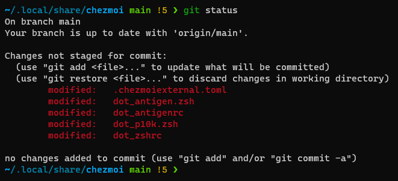

# Michael's dotfiles

I am using [chezmoi] to manage my dotfiles in WSL.



## Installation

Install chezmoi with additional packages:

```sh
pacman -S chezmoi sudo git vim bitwarden-cli keychain
```

Initialize chezmoi with this dotfiles repo.

```sh
chezmoi init https://github.com/michaelvdnest/dotfiles.git
```

Show a quick summary of the what files would change.

```sh
chezmoi status
```

Install dependencies and add files to your `$HOME`.

```sh
chezmoi apply -v
```

### Update machine

Pull the latest changes from your remote repo and run `chezmoi apply`.

```sh
chezmoi update -v
```

## Using Bitwarden to store the SSH keys

### Store the public key

The public key can just stored as a normal in chezmoi. 

```sh
> chezmoi add .ssh/id_rsa.pub
```

### Store the private key

Login into Bitwarden using the [bitwarden-cli] and unlock the vault. 

```sh
> bw login <EMAIL-ADDRESS>
> bw unlock
> export BW_SESSION="<SESSION-ID>"
```

Store the SSH key in a secure note in Bitwarden.

```sh
SECRET_NAME=id_rsa
SECRET_PATH=~/.ssh/id_rsa
echo "{\"organizationId\":null,\"folderId\":null,\"type\":2,\"name\":\"${SECRET_NAME}\",\"notes\":\"$(sed -e ':a' -e 'N' -e '$!ba' -e 's/\n/\\\\n/g' ${SECRET_PATH})\",\"favorite\":false,\"fields\":[],\"login\":null,\"secureNote\":{\"type\":0},\"card\":null,\"identity\":null}"
bw sync #optional
```

### Retrieve the private key

Create a file in your chezmoi repo at this location: private_dot_ssh/private_id_rsa.tmpl and add this as the contents. 

```
{{ (bitwarden "item" "sshkey").notes }}

```

*This file needs a new line character at the end.*

## Status

This is still very much a work in progress. 

**Warning:** I don't recommend that you give these dotfiles a try. However, if you want to give it a try, you should first fork this repository, review the code, and remove things you don’t want or need. Don’t blindly use my settings unless you know what that entails. Use at your own risk!

You can look into the following repo's if you want to try a dotfiles repo as a base:

- https://github.com/felipecrs/dotfiles/tree/master
- https://github.com/szorfein/dots/tree/master


## TODO

A list of items I'm thinking of adding to my config.

- Install the font for p10k
- Use gpg for github instead of keychain
- Cater for both arch and ubuntu

[chezmoi]: https://www.chezmoi.io/ "chezmoi"
[bitwarden-cli]: https://github.com/bitwarden/cli "Bitwarden CLI"
